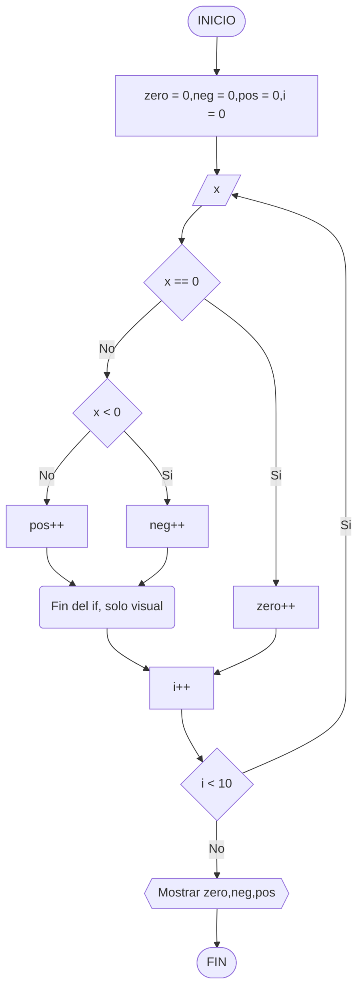

# examenDAM

**Para cambiar la url ya existente en origin se ha usado:**
```
git remote set-url origin "url"
```
**Se procede ahora a editar el README.md y hacer un commit para subir los cambios.**
```
git add README.md
git commit -m "Primer commit examen COD (Cambios en README)"
```
**Ahora se copia el programa boletin11_1 en el repositorio y se hace un commit
para añadirlo, el metodo utilizado es el siguiente:**
```
Se añade la carpeta src al directorio que se esta usando.

Luego de esto se hace el commit y push correspondientes.

git add -A
git commit --author="AutorExamenCOD <examenCOD@gmail.com>" -m "Segundo commit 
examen COD (Cambios en README y se añade src)"  
git push origin master
```
## Ordinograma del programa


**Ahora se hace el último commit de esta manera:**
```
git add -A
git commit -m "Tercer comit examen COD (Ordinograma en README)"
git push origin master
```
**Por último se añade la tag junto a su .jar**

**-Se añade la tag al repositorio:**
```
git tag v1.0
git push --tags
```
**-Se crea el .jar que mas adelante se añade a la Release en github**
```
Se genera un artifact relacionado a la clase App.java (La main) y se hace una build de
este artifact.
```
**El artifact se sube a la Release en github y se relaciona con la tag creada anteriormente**